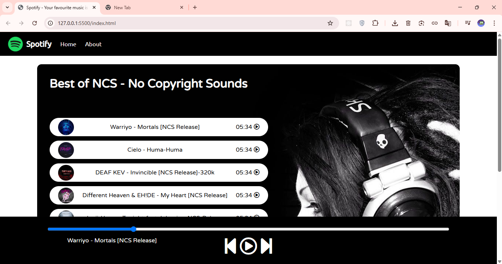

# 🎵 Music Player

A simple and beautiful **web-based music player** built using **HTML, CSS, and JavaScript**.
---
## 🚀 Demo

### 🌐 Live demo: [click here](https://shifat01.github.io/Music-Player/)

#### or, 

### link: https://shifat01.github.io/Music-Player/
---

## 🖼️ Preview



---

## 🔍 Overview

This project is a lightweight, responsive, and easy-to-use music player that lets you play, pause, and switch between multiple tracks.  
It includes a clean UI, album covers, and smooth animations.

---

## ✨ Features

- Play, pause, next, and previous controls  
- Shows current song title and cover  
- Beautiful background and simple design  
- Works offline — no internet required  
- Easy to add your own songs  
- Fully customizable with basic HTML, CSS, and JS knowledge

---

## 🚀 How to Run

1. Clone the repository:
   ```bash
   git clone https://github.com/shifat01/Music-Player.git
   ```

2. Go to the project folder:
   ```bash
   cd Music-Player
   ```

3. Open the project in your browser:
   - Double-click `index.html`, **or**
   - Run this command (Mac/Linux):
     ```bash
     open index.html
     ```

---

## 🧠 How to Add New Songs

1. Copy your `.mp3` file into the **songs/** folder.  
2. Add the cover image to the **covers/** folder.  
3. Open `script.js` and add your new song details inside the song list or array.

---

## 🛠️ Technologies Used

- HTML5  
- CSS3  
- JavaScript (Vanilla)

---

## 💡 Future Improvements

- Add shuffle and repeat features  
- Add volume control and progress bar  
- Make it mobile-friendly (responsive)  
- Add theme switch (light/dark mode)  
- Load songs dynamically from JSON


---

## 🤝 Contributing

Want to improve this project?

1. Fork this repository  
2. Create a new branch:
   ```bash
   git checkout -b feature/your-feature-name
   ```
3. Make your changes and commit:
   ```bash
   git commit -m "Added a new feature"
   ```
4. Push and create a Pull Request

---

## 📝 License
- [MIT License](LICENSE)

This project is licensed under the **MIT License**.  
Feel free to use, modify, and share.

---

© 2025 [Shifat01](https://github.com/shifat01) — All Rights Reserved.
